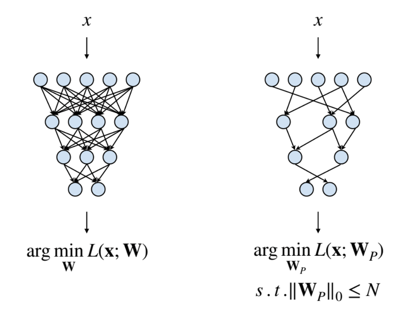
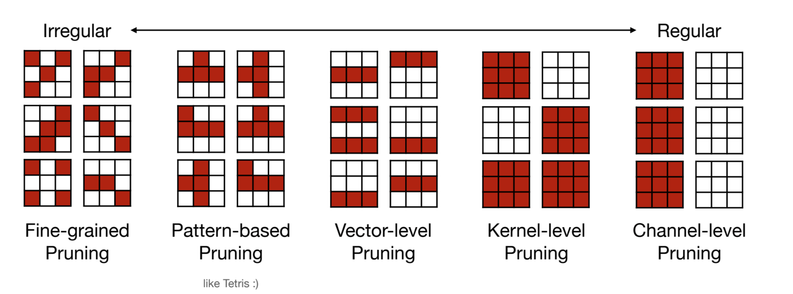
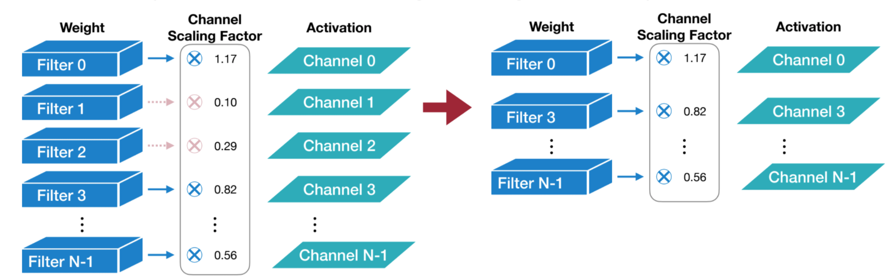
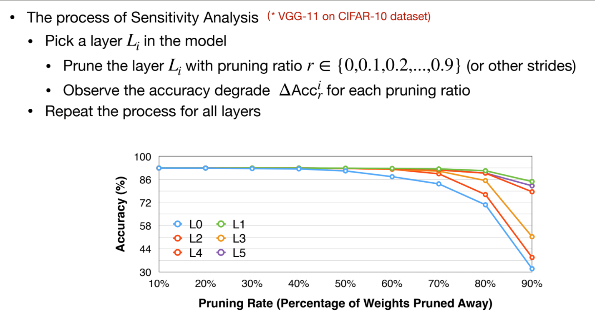
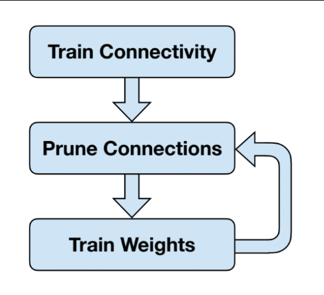

# Pruning

!!! note "对应课程内容"

    MIT6.5940 Lecture 3-4 内容

## What is Pruning

**Pruning**, also called **Sparsity**, is a way to reduce the number of calculations in a neural network by removing some of the weights or neurons. The goal is to reduce the size of the model and make it more efficient.

From the perspective of implementation, weights are often represented as a dense matrix in neural network, such as weight tensors in MLP or CNN. With pruning, we can remove some of the weights in the matrix, and set them to zero, which **make the matrix sparse**.

In this way, we can reduce the number of computation as well as memory usage, and make the model more efficient.

{: width="50%"}

## Pruning Granularity

There are a few levels of pruning granularity:

- **Fine-grained**: Prune individual weights in the model.
  - **Pros**: More flexible, can prune any weight in the model. Thus it can reach higher sparsity at the same performance level.
  - **Cons**: More difficult to implement, and may not be as efficient as coarse-grained pruning.
- **Pattern-based**: Prune weights based on certain patterns, such as *N:M Sparsity*
  - **Pros**: More efficient than fine-grained pruning. Can be implemented more easily and supported by hardware.
  - **Cons**: Less flexible, may not be able to prune all the weights.
- **Channel Sparsity**: Prune entire channels in the model.
  - **Pros**: More efficient than fine-grained pruning. Can be implemented more easily and supported by hardware. Just a smaller dense matrix.
  - **Cons**: Less flexible, may not be able to prune all the weights.

总的来说，不同的 Pruning Granularity 主要是 Flexibility 和 Hardware Efficiency 之间的 trade-off. 更细粒度更灵活，但硬件难以支持；更粗粒度硬件更容易实现，但灵活性更差。

可以再讨论一下 Flexibility。Flexibility 越好意味着对 unimportant parameters 的分布的要求越低，越能够更有效、更精准地对 unimportant parameters 进行 pruning，从而达到更高的 sparsity and performance。

## Pruning Criterion

Pruning Criterion 是指在进行 Pruning 时，如何判断一个 parameter 是不是 unimportant，从而可以被 Prune 掉。

### Magnitude-based Pruning

一个 heuristic 的方法是 Magnitude-based Pruning，即根据参数的大小来判断是否可以被 Prune 掉。具体来说，可以有以下几种方法：

- Element-wise: Absolute value of the weight
- Row-wise: L1-norm/L2-norm of the row
- Channel-wise: Add a trainable scaling factor for each channel.

### Error-minimization based Pruning

另一个更 reasonable 的想法是比较量化前后对 Loss 产生的影响，通过最小化这个影响来进行 Pruning。通过求梯度的方法可以得到每个参数对 Loss 的影响，从而可以进行 Pruning。

$$
\text{importance_{w_i}} = \frac 1 2 h_{ii}w_i^2
$$

其中 $h_ii$ 是 Hessian 矩阵的对角元素，$w_i$ 是参数的值。然而求 Hessian 矩阵是一个很复杂的过程，因此这种方法并不是很实用。

### Pruning Neuron

对神经元进行 Pruning，本质上就是对涉及到该神经元的 Weight 进行 Pruning（可以看作一种 coarse-grained Pruning）。Pruning Neuron 的一个好处是可以减少模型的复杂度，减少计算量。

而他的 Criterion 不能对 Weight 进行分析，而是对 Activation 进行分析，即对神经元的输出进行分析。具体来说，可以有以下几种方法：

1. Percentage-of-Zero-Based Pruning：观察神经元的输出，如果输出为 0 的比例超过某个阈值，那么可以认为这个神经元是 unimportant 的。
2. Regression-Based Pruning：比较 Pruned 和 Unpruned 的神经元的输出，如果输出的差异很小，那么可以认为这个神经元是 unimportant 的。

## Pruning Ratio

### Layer Sensitivity Analysis

通过只对一层进行 Pruning，可以分析每一层对 pruning 的敏感程度。

这种方法不一定有效，因为它没有考虑到不同层之间的相互影响。

### Auto Pruning

可以利用强化学习的方法，以最小化 Loss 为目标，来自动选择 Pruning Ratio。

- AMC
- NetAdapt

## Train/Finetune after Pruning

Pruning 之后，模型的性能会下降，因为 Pruning 会导致模型的复杂度降低，从而导致性能下降。因此，需要对 Pruned 模型进行 Finetune，以提高性能。

Finetune 其实就是对 Pruned 模型进行重新训练，但是需要注意的是，Finetune 的时候学习率要设置的比较小，因为 Pruned 模型已经比较稳定，不需要太大的更新。

一个基本的思路是先进行 Pruning，再进行 Finetune，然后再在 Finetune 之后的模型上进行 Pruning，然后再进行 Finetune，如此循环。

## Hardware Supports for Pruning

### EIE

### TensorCore: M:N Weight Sparsity

### TorchSparse and PointAcc

## References

- [EfficientML.ai Lecture 3 - Pruning and Sparsity Part I (MIT 6.5940, Fall 2024)](https://www.youtube.com/watch?v=EjsB0WgIfUM)
- [EfficientML.ai Lecture 4 - Pruning and Sparsity Part II (MIT 6.5940, Fall 2024)](https://www.youtube.com/watch?v=upaZrpXkELc)
- [EfficientML.ai Lecture 3 - Slides](https://www.dropbox.com/scl/fi/6qspcmk8qayy7mft737gh/Lec03-Pruning-I.pdf?rlkey=9jpifc92be0sitiknpbhn9ggf&e=1&st=lml94lam&dl=0)
- [EfficientML.ai Lecture 4 - Slides](https://www.dropbox.com/scl/fi/w5baiyci5cxl1ozpy6lsr/Lec04-Pruning-II.pdf?rlkey=6qxc1nz20isy9izwnqfebtukg&e=1&st=59gy1eal&dl=0)
