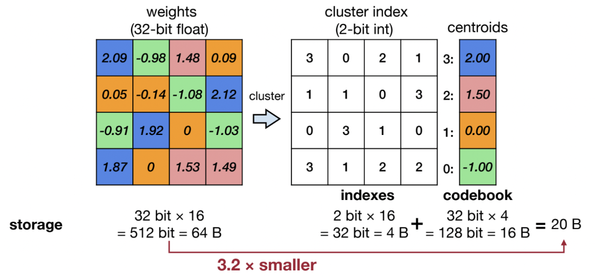
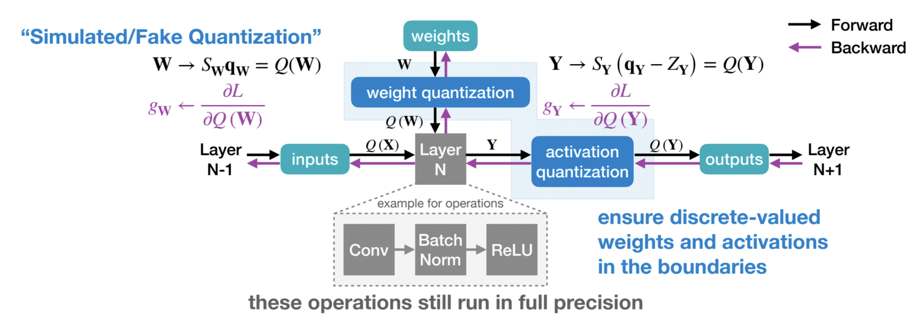
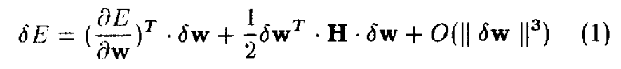
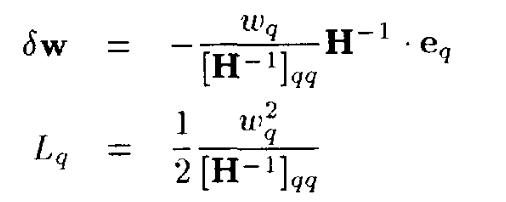
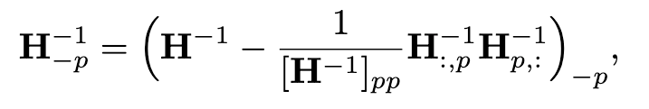
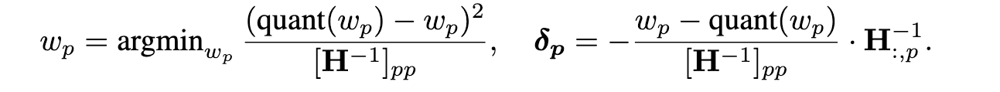
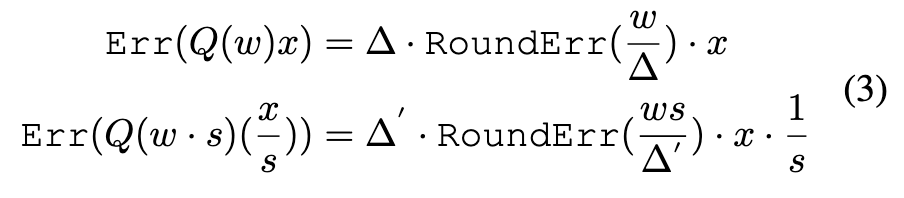
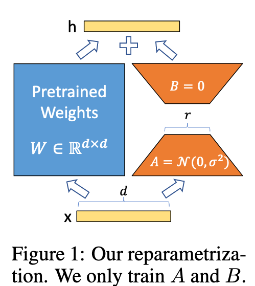
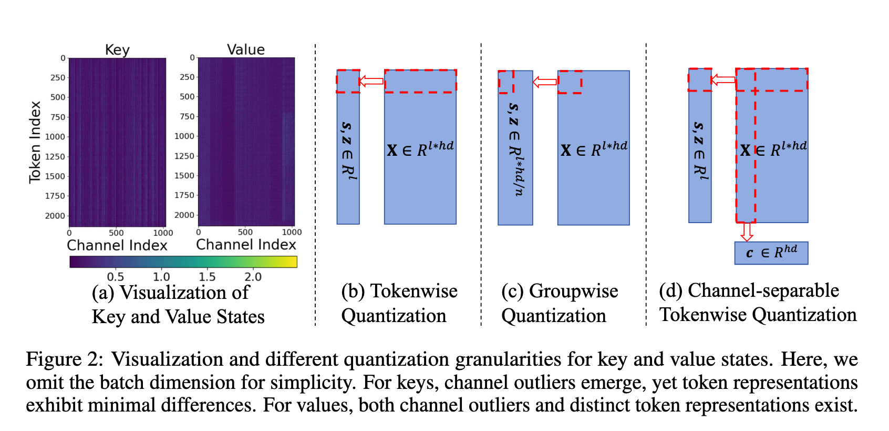
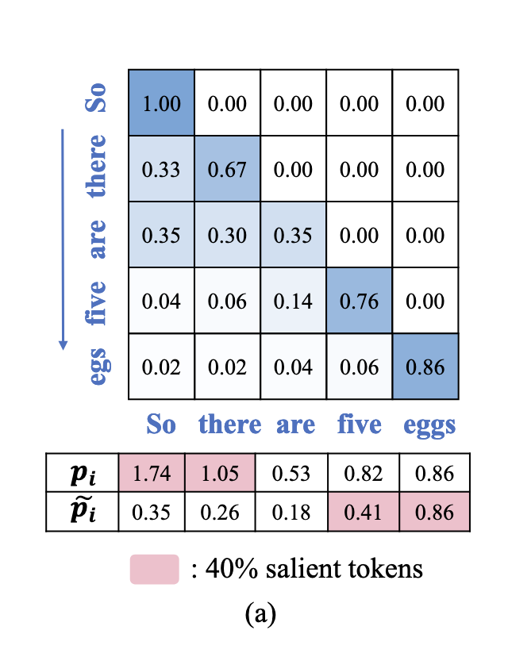

# 量化综述：从 GPTQ 到 ZIPCache

这篇博客将从量化的概念开始，到介绍 GPTQ、AWQ、QLoRA、QLLM 和 ZIPCache 等量化技术，呈现 Overview of Quantization。

## 什么是量化？

> 此处参考了 MIT 6.5940 的课程内容。

### 基本概念

量化 (Quantization) 的核心想法是通过降低数值存储和计算的精度来降低访存 (Memory Access) 和计算 (Computation) 的开销。

我认为量化目前 work 的核心在于一个基本假设：Parameters are not fully trained. 基于这个假设，才能够推出目前的精度表示是存在浪费的，从而量化能够 improve efficiency while maintaining the performance。这和 Scaling Laws for Precision (Kumar, 2024) 的想法是一致的，即当数据量到达一定程度，参数被充分训练后，低精度量化会带来显著的性能下降。

### 数据类型

这部分介绍一些基本的量化数据类型，需要查阅的时候可以参考。

- FP64: 深度学习要什么 FP64.jpg
- FP32: float, 1+8+23
- FP16: half, 1+5+10
- BP16: 1+8+7, 深度学习要什么精度.jpg
- FP8: 分为 E4M3 和 E5M2 两种，分别是 1+4+3 和 1+5+2
- FP4: 1+2+1, Blackwell Architecture 添加了原生支持（对其实用性深表怀疑）
- NF4: QLoRA 提出，数值的分布是正态分布而非均匀分布，详见 QLoRA 阅读笔记部分
- INT8, INT4: 1+7/3, 整数表示

### 基本方法

#### K-Means-based Quantization

核心思路：Weight -> K-mean clusters -> index + codebook = QWeight



低精度存储 index，高精度存储 codebook

但现在这种方法不是主流：

1. K-means 难以处理 outlier 的问题
2. 需要高精度存储 codebook，compress rate 不高
3. 只减小了访存量，计算时引入额外的 dequant overhead，计算性能并没有提升

#### Linear Quantization

目前的主流方法。

核心思路：$\text{weight} = (\text{qweight} - \text{zero}) \times \text{scale}$

??? 量化参数的计算

    $$
    \\
    \begin{aligned}
    r_{\text{max}} = S(q_{\text{max}} - Z)\\
    r_{\text{min}} = S(q_{\text{min}} - Z)
    \end{aligned}
    $$

    由此推导出 $S, Z$ 的计算公式：

    $$
    S = \frac {r_{\text{max}} - r_{\text{min}}} {q_{\text{max}} - q_{\text{min}}}
    $$

这个思路支持多种量化方案：

- Weight Only Quantization: 和 K-Means-based 类似，引入额外 overhead from dequantization，适用于 memory bound 的 decoding 阶段。
- Weight and Activation Quantization: 可以充分利用硬件特性编写 customized kernel 直接进行低精度运算得到结果，既减小访存开销也减小计算开销。

### QAT 与 PTQ

目前主流在 LLM 中的量化应用主要分两种：QAT (Quantization-Aware Training) 和 PTQ (Post-Training Quantization)。

#### QAT

在训练阶段就采用量化，将量化后权重的 rounding error 在训练阶段就纳入考虑，从而减少量化带来的 performance degradation。



#### PTQ

通过量化训练好的权重来提升模型推理性能，因为不需要重新训练模型而成本较低，广泛使用。

下面介绍一些量化的粒度（即将若干权重进行 grouping，计算量化参数）。粒度越小量化损失越低，但存储量化参数的开销越大。

- Per-Tensor Quantization
- Per-Channel Quantization
- Group Quantization
- Multi-level Quantization: $r = (q-z) \cdot s_0 \cdot s_1 \cdots$. level 越低，粒度越低，量化参数精度越低。是 Low Compression Rate 和 High Flexibility 的折中。

## GPTQ: 从 Pruning 到 Quantization

### OBS、OBC、OBQ：GPTQ 的前世今生

??? quote
    - B. Hassibi, D. G. Stork, and G. J. Wolff, “Optimal Brain Surgeon and general network pruning,” in IEEE International Conference on Neural Networks, Mar. 1993, pp. 293–299 vol.1. doi: 10.1109/ICNN.1993.298572.
    - E. Frantar, S. P. Singh, and D. Alistarh, “Optimal Brain Compression: A Framework for Accurate Post-Training Quantization and Pruning,” 2022, arXiv. doi: 10.48550/ARXIV.2208.11580.

#### OBS

OBS 本来是用于 pruning 的，核心想法是：将某个 weight 的值设置为 0，同时调整其他位置的权重，使总体上对 loss 的影响最小。

对 loss function 的微分进行泰勒展开，充分训练下没有一阶导项，忽略高阶微分项，最终得到 delta loss function 的表达式。



然后在 pruning 约束条件下对目标函数进行拉格朗日乘数法求解，最终得到两个关键表达式。



1. 对其他权重的变化量 $\delta_{\mathbf{W}}$（最后两个因子可以简化为 $H^{-1}$ 的第 q 列）
2. 优化 q 对整个 loss 引起的变化 $L_q$ ，这个可以用来找到最佳的 q

#### OBC & OBQ

OBC 在 OBS 的基础上假设 Hessian 矩阵的每一行相对独立（基于参数独立假设），并提出了对 Hessian 的迭代更新算法，避免频繁对 Hessian 矩阵求逆。



而 OBQ 将 pruning 视为一种特殊的 quantization，从而将 OBC 改造为 quantization 算法。


整个量化过程是：

1. 针对每一行，找到对 loss 影响最小的权重，对其进行量化
2. 计算 $\delta_p$，更新其他权重
3. 更新 Hessian 矩阵
4. 重复 1-3 步，直至完成该行的更新
5. 每一行的更新是独立的，可以并行

在量化时还有一个 trick，对于量化中的 outliers，他们在量化前后会造成较大的 error，在贪心算法中会让他们最后才被 quantized，
而这样最后还未量化的权重数量很少，难以通过调整其他权重减小 loss。因此需要让 outliers 尽早被 quantize。

### GPTQ 的核心想法

??? quote
    - E. Frantar, S. Ashkboos, T. Hoefler, and D. Alistarh, “GPTQ: Accurate Post-Training Quantization for Generative Pre-trained Transformers,” Mar. 22, 2023, arXiv: arXiv:2210.17323. doi: 10.48550/arXiv.2210.17323.

在 OBQ 的基础上改进，主要有以下三点：

1. 将基于 delta loss 的贪心算法改成顺序的算法，因为顺序在大模型下基本不影响量化效果。这样就可以以同样的顺序量化每一行
2. Lazy Batch Update：OBQ 中每 quantize 一个参数就要更新所有的参数，
    而在 GPTQ 中，他将 columns 分成若干组 block，分成 local update 和 global update。

    local update 是在 block 内部，将前面量化参数的影响更新到 block 内的后续参数中；

    global update 则是在一个 block 更新完后，利用矩阵运算对后续所有参数进行批量更新。

    这样 local update 的计算量较小，而计算量较大的 global update 又可以通过 batched update 的方式充分利用计算资源。

3. 利用 Cholesky 分解预计算 $H^{-1}$ 。由于量化的顺序已经确定，所以可以直接预计算 $H^{-1}$ 。这个预计算的过程和 Cholesky 分解等价。

**所以最核心的 idea 就是第一条的 insight，即 order does not matter。** 量化顺序的 in order 带来了 update in batch，带来了 precompute $H^{-1}$ 。

### GPTQ 代码实现

??? note "核心代码"
    ```python
    damp = percdamp * torch.mean(torch.diag(H))
    diag = torch.arange(self.columns, device=self.dev)
    H[diag, diag] += damp
    H = torch.linalg.cholesky(H)
    H = torch.cholesky_inverse(H)
    H = torch.linalg.cholesky(H, upper=True)
    Hinv = H

    for i1 in range(0, self.columns, blocksize):
        i2 = min(i1 + blocksize, self.columns)
        count = i2 - i1

        W1 = W[:, i1:i2].clone()
        Q1 = torch.zeros_like(W1)
        Err1 = torch.zeros_like(W1)
        Losses1 = torch.zeros_like(W1)
        Hinv1 = Hinv[i1:i2, i1:i2]

        for i in range(count):
            w = W1[:, i]
            d = Hinv1[i, i]

            if groupsize != -1:
                if not static_groups:
                    if (i1 + i) % groupsize == 0:
                        self.quantizer.find_params(W[:, (i1 + i):(i1 + i + groupsize)], weight=True)
                else:
                    idx = i1 + i
                    if actorder:
                        idx = perm[idx]
                    self.quantizer = groups[idx // groupsize]

            q = quantize(
                w.unsqueeze(1), self.quantizer.scale, self.quantizer.zero, self.quantizer.maxq
            ).flatten()
            Q1[:, i] = q
            Losses1[:, i] = (w - q) ** 2 / d ** 2

            err1 = (w - q) / d
            W1[:, i:] -= err1.unsqueeze(1).matmul(Hinv1[i, i:].unsqueeze(0))
            Err1[:, i] = err1

        Q[:, i1:i2] = Q1
        Losses[:, i1:i2] = Losses1 / 2

        W[:, i2:] -= Err1.matmul(Hinv[i1:i2, i2:])
    ```

相比于 OBQ 的代码，不需要再进行 Hessian 矩阵的更新，而是直接使用 Cholesky 分解对 Hessian 进行预计算。
同时通过两层循环实现了对权重的 local update 和 global update。

### 对 GPTQ 的一些思考

GPTQ 虽然非常有效，但主要还是基于 Hessian 矩阵的调整，而 Hessian 矩阵是通过 $H=2X^TX$ 近似得到的，从而不可避免地存在偏差。

GPTQ 最重要的思想还是在 OBS 中提出的通过 Tayler Expansion 转换成一个优化问题，通过调整其他参数来使整体 loss 最小的一个思路。这个思路可以用到很多地方，值得注意。

## AWQ

??? quote
    - J. Lin et al., “AWQ: Activation-aware Weight Quantization for On-Device LLM Compression and Acceleration,” Proceedings of Machine Learning and Systems, vol. 6, pp. 87–100, May 2024.

### AWQ 的核心想法

AWQ 基于一个 observation: 保留 1% salient weights 不被量化可以显著提升量化后模型的 performance。

接下来问题是如何判断 salience：AWQ 基于 magnitude of activation 来判断 salience，而不是 weights。
这是很合理的。因为我们要判断 weights 的 salience，那么当 magnitude of activation 越大，对应 weight 的微小变化对 output 的影响就越大。

在此基础上，AWQ 想要进一步量化 salient weights：利用 Activation-aware Scaling 来减小 salient weight 量化后的 error。



可以看到，当对 weight 和 input 分别施加相反的 scaling factor，最终的 error 会随着 s 的增大而减小。这便是 AWQ 的核心机制。

需要注意的是，这里有一个核心假设：“Scaling up a single element w usually does not change the maximum value from the group w. Therefore we have ∆′ ≈ ∆”
有了这个假设的存在，才能够保证额外的 scaling 是生效的。否则的话 scaling 越大 ∆′ 也会越来越大，从而导致误差越来越大。

这也是 scaling salient weight only 的原因，因为如果 scaling 所有 weight，这个假设便不再成立，从而使 error 越来越大。

最终实际上 AWQ 对每一个 input channel 都计算一个 scaling factor，scaling factor 基于 magnitude of activation 来决定。

scaling factor vector $\mathbf{s} = \mathbf{s}_{\mathbf{x}} ^ \alpha$，通过 grid search 找到最佳 $\alpha$

### AWQ 代码实现

我跑了一下 AWQ 的 examples，发现 AWQ 实现了 W4A4 的量化，设计了基于 INT4 的 customed CUDA kernel 来进行推理。

所以 AWQ 的量化过程包括以下几个部分：

1. 使用论文中提到的方法对权重进行量化
2. 将量化后的 INT4 权重 pack 存储到 INT32 中。
3. 将模型原有的 Linear 层替换为 QLinear 层，其中调用 customed kernel 进行 INT4 Inference

由此，AWQ 能够在计算和访存上都减少开销。

### 对 AWQ 的一些思考

AWQ 中有一些思路可以进行学习：

1. weight salience 应该考虑 activation 而不是 weight 本身。因为当 magnitude of activation 越大，对应 weight 的微小变化对 output 的影响就越大。
2. 这个 scaling 看起来非常 tricky，不知道背后有没有一些更深层次的想法，后续可以留意一下。

## QLoRA

??? quote
    - E. J. Hu et al., “LoRA: Low-Rank Adaptation of Large Language Models,” Oct. 16, 2021, arXiv: arXiv:2106.09685. doi: 10.48550/arXiv.2106.09685.
    - T. Dettmers, A. Pagnoni, A. Holtzman, and L. Zettlemoyer, “QLoRA: Efficient Finetuning of Quantized LLMs,” Advances in Neural Information Processing Systems, vol. 36, pp. 10088–10115, Dec. 2023.

### LoRA: low-rank fine-tuning

通过在权重上加上一对低秩矩阵乘来对权重进行微调。

核心：$W' = W + AB$

{:width="50%"}

当 $r << d$ 时，finetuning 时需要的参数就大大减小。

### QLoRA 的核心想法

QLoRA 的目的是为了通过量化优化 LoRA 过程，但是其中的一些量化思想还是可以学习的。同时 QLoRA/LoRA 现在还是主流的 fine-tune 方法。

关于 QAT/PTQ：QLoRA 虽然是用于微调（训练）环节，但是其量化的是原权重，而在 LoRA 中原权重不需要被更新，因此其中的思路还是偏 PTQ 一些

QLoRA 主要两个核心思路

一是提出 NF4，基于 weights 大多遵循 normal distribution 的 insight，因此权重在每一个量化值的概率分布不是均匀的，自然量化值的分布也不应该是均匀的。
在概率越大的地方量化值分布应该更集中以获得更高的精度，而在概率小的地方量化值分布应该更稀疏。

二是提出双量化（可以看作是一种 2-level quantization），level-1 是用 small group size 对参数进行量化。由于 group size 较小，会产生许多 additional parameters for each group。
然后 level-2 对 group in level 1 再进行一个分组，对 additional parameters 再进行量化。这样既有 small group size 对精度的优势，
又避免了 small group size 带来更多 additional parameters 造成的显存占用问题。

### 对 QLoRA 的一些思考

- 我觉得 NF4 这个数据类型的思考挺合理的，但是并没有成为主流，是否因为目前硬件并不支持 NF4 的运算呢？如果是这样的话，那为什么 QLoRA 还要坚持使用 NF4 呢？可以做一些实验试试，NF4 在 finetuning 这个场景下有什么特别的作用吗？
- QLoRA 这个 double quantization 可以留意一下。他和 multi-level quantization 不一样。double quantization 是对第一次量化的量化参数再进行量化，而 multi-level quantization 则是在不同 level 采用不同的量化粒度和不同的量化参数精度。
    个人认为 multi-level quantization 更合理一些，double quantization 更像只是为了提高压缩率的一个 trick，不过不失为一种在细粒度量化下改善压缩率的方法。

## QLLM

??? quote
    - J. Liu, R. Gong, X. Wei, Z. Dong, J. Cai, and B. Zhuang, “QLLM: Accurate and Efficient Low-Bitwidth Quantization for Large Language Models,” Apr. 06, 2024, arXiv: arXiv:2310.08041. doi: 10.48550/arXiv.2310.08041.

### QLLM 的核心想法

核心思想是在不同 channels 之间进行 reassembly

$$\mathbf{y} = \sum \mathbf{x}_i \mathbf{W}_{i, :}$$

这个 summation 中的每一项为一个 channel 的计算结果，核心思想是保证最终结果 summation 不变的前提下，在不同 channels 之间分配，进行 reassembly，从而减小 outliers 对 quantization 的影响。

Reassembly 主要分为 disassembly 和 assembly 两步。

- Disassembly 将一个 channel 拆分成多个 sub-channels，从而将权重值限定在 threshold 之内
- Assembly 将多个相似 channels 的权重进行加总合并，从而实现对 channels 的合并

    这个有一个问题就是在对权重进行 reassembly 的同时，也需要对输入 $\mathbf{x}$ 进行 reassembly，这会引来一定的开销，并且是 memory-access intensive 的。

- Disassembly 需要对 $\mathbf{x}$ 的对应 channels 进行拆分（实现上是 scaling + repeating）
- Assembly 需要对 $\mathbf{x}$ 对应的 channels 求均值

### 对 QLLM 的一些思考

- 在不同 channels 之间进行权重的重新分配从而缓解 outlier 的问题，我觉得这个想法是非常好的。从 $\mathbf{y} = \sum \mathbf{x}_i \mathbf{W}_{i, :}$
    出发，保持 summation 不变的情况下在不同 terms 之间进行分配，这个思路非常有意义。
- 但是这样引入的额外计算我觉得有点不够优雅，能否有一个能够在不同 channels 之间分配，而又能够更好地减少 overhead 的方法呢？

## ZipCache

??? quote
    - Y. He, L. Zhang, W. Wu, J. Liu, H. Zhou, and B. Zhuang, “ZipCache: Accurate and Efficient KV Cache Quantization with Salient Token Identification,” May 23, 2024, arXiv: arXiv:2405.14256. doi: 10.48550/arXiv.2405.14256.

### ZipCache 的核心想法

第一个是在 KV Cache 压缩时通常从 token-wise 压缩，然而 outlier 的分布是在 channel 维度上的，这样就会使每一个 token 的压缩都会受到 outlier 的严重影响。  
为此，ZipCache 提出在 channel-wise 上做一个 normalization，使 channels 之间的 magnitude 在同一 level，从而显著减小 outlier 的影响。



第二个是在 KV Cache Compression 中判断 salient tokens 时，主流工作用的都是 accumulated attention score 作为 metrics，但这个标准会存在问题，没有考虑到每个 accumulated score 的 summation terms 数量不同，同时会受到 softmax 的归一化影响，所以是不合理的  
为此，ZipCache 提出 normalized attention score，即在非零元素之间求 mean



同时还指出在计算 Salience 的时候需要计算整个 attention score matrix，这与 flash attention 不兼容。为此 ZipCache 提出对 tokens 进行 samples，以部分 tokens 对整个序列其他 tokens 的 attention scores 来进行近似。

### 对 ZipCache 的一些思考

- ZipCache 和上面一些工作的不同之处是，ZipCache 专注于对 KV Cache 的量化，而上面的工作都是专注于对 Linear weight 的量化。从这里可以看到 KV Cache Compression 具有自己的特点，可以带来一些和 weight quantization 不一样的思路和创新点。
- 个人很喜欢 ZipCache 提出的两个想法，这两个 idea 都是基于前人工作的基础上，基于 KV Cache Compression 的某些特点去进行改进。整个思路我觉得非常清晰且自然。
- 在兼容 Flash Attention 时提出的 sampling 的思路我觉得也具有一定的普适性，虽然在理论上缺少一定的支撑，但是在工程上具有一定的实践意义，后续可以留意一下。

## 下一步工作

- 本文基本介绍的都是 PTQ 相关技术，可以进一步研究 QAT。
- 本文只选取了一些在各个应用的代表性工作，后续可以在某一个方向上做更详细的调研
- 本文很大篇幅都在介绍 weight quantization，对 KV cache compression 介绍较少，可以进一步进行专题研究。
